# C++ Bug Tracer

An OpenCode skill for investigating bugs in C++ codebases using coordinated AI agents.

## Workflow



The orchestrator classifies the bug into one of 6 categories, then spawns parallel investigator threads. Each investigator follows a single execution path (read → grep → follow call chain). The orchestrator synthesizes results into a structured root cause report.

**Bug categories:**
| Category | Key signals | Strategy |
|---|---|---|
| Event/notification mismatch | "handler never fires", "wrong handler called" | Thread A: sender value · Thread B: receiver mapping |
| Counter/metric wrong | "count is double", "always N" | Grep all increment sites first |
| ID/key lookup failure | "not found", "always same result" | Thread A: generate+store · Thread B: lookup path |
| Conditional behavior | "only for product X", "only on first load" | Trace the branch condition and how state is set |
| Cross-layer state | "field wrong", "disabled unexpectedly" | Trace UI → signal → business logic |
| Should fail but doesn't | "can do X twice", "second call succeeds" | Thread A: guard path · Thread B: state update after success |

## Structure

```
cpp-bug-tracer/
├── README.md
├── BENCHMARK.md              # Detailed benchmark results
├── workflow.{yml,mmd,svg}    # Workflow config and diagram
├── SKILL.md                  # Skill definition
├── agents/
│   ├── orchestrator.md       # Primary agent: classifies bug, spawns investigators, synthesizes
│   ├── investigator.md       # Subagent: follows one execution thread (read + grep)
│   ├── abstractor.md         # Subagent: text-only synthesis of multi-thread findings
│   ├── explorer.md           # Subagent: maps codebase structure by layer
│   ├── planner.md            # Subagent: investigation planning
│   ├── router.md             # Entry point: routes to bug-tracer or cross-source-tracer
│   └── cross-source-tracer/  # Pipeline for external data source format changes
└── evals/
    ├── evals.json            # 35 benchmark cases across 7 tiers
    └── codebase/             # Synthetic C++ codebase for evaluation
```

## Installation

```bash
mkdir -p ~/.config/opencode/agents/cpp-bug-tracer
cp agents/*.md ~/.config/opencode/agents/cpp-bug-tracer/
cp -r agents/cross-source-tracer ~/.config/opencode/agents/cpp-bug-tracer/
```

## Usage

```bash
opencode run --agent cpp-bug-tracer/orchestrator \
  "Why does releasing a credit reservation always fail? Codebase: /path/to/project"
```

For external data source format changes (API version migrations, queue schema changes):
```bash
opencode run --agent cpp-cross-source-tracer/orchestrator \
  "API v2 changed field names, trades are being blocked. Codebase: /path/to/project"
```

## Agents

| Agent | Mode | Tools | Role |
|-------|------|-------|------|
| orchestrator | primary | read, grep, glob, task | Classifies bug, spawns investigators, synthesizes report |
| investigator | subagent | read, grep, glob | Follows one call chain, reports file:line evidence |
| abstractor | subagent | none | Synthesizes findings from multiple threads (text only) |
| explorer | subagent | grep, glob | Maps codebase structure, locates relevant files |
| planner | subagent | read | Plans investigation strategy |
| router | primary | read, grep, glob, task | Routes to appropriate pipeline based on bug type |

## Tips for Best Results

**Do:**
- Include component/class names when known (e.g., "CTradeServiceFacade::SettleAndNotify")
- Describe the symptom concretely (e.g., "counter shows 20 instead of 10")
- Mention what changed recently (e.g., "started after API v2 upgrade")
- Note any audit logs or error messages verbatim

**Avoid:**
- Vague symptoms without context (e.g., "trades fail") — may hit orchestrator bottleneck
- Trusting audit logs as truth — they can be false witnesses
- Assuming the first suspicious pattern is the root cause

**For API/external data bugs:**
- Mention the data source type: "API response", "message queue", "Windows registry"
- Note version changes: "API upgraded to v2", "new provider onboarded"
- Quote field names if you know them: "credit_limit_usd field"

**For cross-file bugs:**
- Name both services if you suspect a mismatch
- Describe the expected vs actual behavior at each layer

## Known Limitations

Based on benchmark testing across 35 evals (see [BENCHMARK.md](./BENCHMARK.md)):

| Limitation | Impact | Mitigation |
|------------|--------|------------|
| **Orchestrator classification bottleneck** | Vague symptom-only prompts can exhaust step budget before investigators spawn | Router layer provides separate step budget per stage |
| **Training-data contamination** | Model may find known files from training instead of actual bug files | Explicit anti-contamination prompts listing trap files |
| **False witness audit logs** | Logs that "prove" correct values can mislead investigation | Investigators must trace the full chain, not trust logs |
| **stoi anchoring** | Investigators may fixate on `std::stoi` truncation when the real bug is earlier | Two-step pattern matching in investigator prompts |
| **Keyword collision across evals** | Similar domains (e.g., "fee", "credit") cause wrong-file routing | Source-type disambiguation in router + unique file naming |
| **Cross-file synthesis gaps** | Multi-agent may find both files but fail to connect them | Abstractor explicitly compares thread outputs |

**When to use which pipeline:**
- **Multi-agent (orchestrator)**: Best for cross-file bugs where each file looks correct in isolation
- **Single-agent**: Better for vague prompts without component names, or simple single-file bugs
- **Cross-source-tracer**: Specialized for API/queue format changes where source and parser must be diffed

## Benchmark Summary

| Config | Evals 1-11 | Evals 12-30 | Evals 31-35 | Notes |
|--------|------------|-------------|-------------|-------|
| multi-agent (qwen3) | 10/11 | 21/23 | 3/5 | Best for cross-file synthesis |
| single-agent (qwen3) | 8/11 | 23/23 | 2/5 | Best for vague prompts |
| single-agent (glm5) | 10/11 | — | 3/5 | Stronger multi-file tracing |
| cross-source-tracer | — | — | 2.5/3 | Best for source→parser diffs |
| router (qwen3) | — | 1.5/2 (vague) | — | Fixes orchestrator bottleneck |

See [BENCHMARK.md](./BENCHMARK.md) for detailed results per eval.
